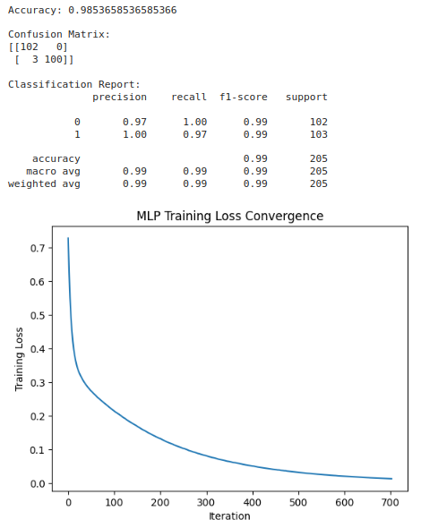

<H3>Sam Israel D</H3>
<H3>212222230128</H3>
<H3>EX. NO. 6</H3>
<H3>DATE: 12/11/2024</H3>
<H1 ALIGN =CENTER>Heart attack prediction using MLP</H1>
<H3>Aim:</H3>  To construct a  Multi-Layer Perceptron to predict heart attack using Python
<H3>Algorithm:</H3>
- Step 1:Import the required libraries: numpy, pandas, MLPClassifier, train_test_split, StandardScaler, accuracy_score, and matplotlib.pyplot.
- Step 2:Load the heart disease dataset from a file using pd.read_csv().
- Step 3:Separate the features and labels from the dataset using data.iloc values for features (X) and data.iloc[:, -1].values for labels (y).
- Step 4:Split the dataset into training and testing sets using train_test_split().
- Step 5:Normalize the feature data using StandardScaler() to scale the features to have zero mean and unit variance.
- Step 6:Create an MLPClassifier model with desired architecture and hyperparameters, such as hidden_layer_sizes, max_iter, and random_state.
- Step 7:Train the MLP model on the training data using mlp.fit(X_train, y_train). The model adjusts its weights and biases iteratively to minimize the training loss.
- Step 8:Make predictions on the testing set using mlp.predict(X_test).
- Step 9:Evaluate the model's accuracy by comparing the predicted labels (y_pred) with the actual labels (y_test) using accuracy_score().
- Step 10:Print the accuracy of the model.
- Step 11:Plot the error convergence during training using plt.plot() and plt.show().
<H3>Program: </H3>

##### Import the necessary packages
```python
import numpy as np
import pandas as pd
from sklearn.neural_network import MLPClassifier
from sklearn.model_selection import train_test_split
from sklearn.preprocessing import StandardScaler
from sklearn.metrics import accuracy_score, confusion_matrix, classification_report
import matplotlib.pyplot as plt
```
##### Load the dataset
```python
data = pd.read_csv('heart.csv')
```
##### Separate features and labels
```python
X = data.drop('target', axis=1).values  # Features (excluding 'target' column)
y = data['target'].values  # Labels
```
##### Split the dataset into training and testing sets
```python
X_train, X_test, y_train, y_test = train_test_split(X, y, test_size=0.2, random_state=42)
```
##### Normalize the feature data
```python
scaler = StandardScaler()
X_train_scaled = scaler.fit_transform(X_train)
X_test_scaled = scaler.transform(X_test)
```
##### Create and train the MLP model
```python
mlp = MLPClassifier(hidden_layer_sizes=(64,), max_iter=1000, random_state=42)
mlp.fit(X_train_scaled, y_train)
```
##### Training loss (optional for visualization)
```python
training_loss = mlp.loss_curve_
```
##### Make predictions on the testing set
```python
y_pred = mlp.predict(X_test_scaled)
```
##### Evaluate the model
```python
accuracy = accuracy_score(y_test, y_pred)
conf_matrix = confusion_matrix(y_test, y_pred)
classification_rep = classification_report(y_test, y_pred)
```
##### Print the results
```python
print(f"Accuracy: {accuracy}")
print("\nConfusion Matrix:")
print(conf_matrix)
print("\nClassification Report:")
print(classification_rep)
```
##### Plot the error convergence
```python
plt.plot(training_loss)
plt.title("MLP Training Loss Convergence")
plt.xlabel("Iteration")
plt.ylabel("Training Loss")
plt.show()
```

<H3>Output:</H3>



<H3>Results:</H3>
Thus, an ANN with MLP is constructed and trained to predict the heart attack using python.
